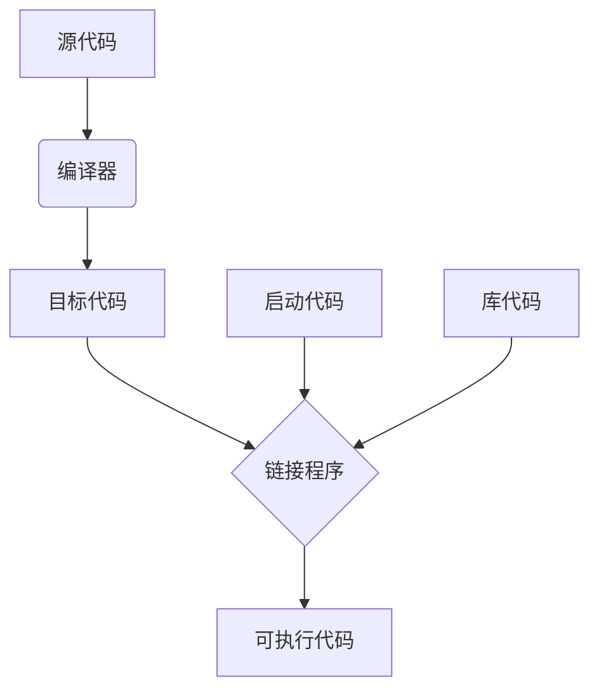

# C++ Primer Plus

## 第1章 预备知识

### 1.1 C++简介

### 1.2 C++简史

### 1.3 可移植性和标准

### 1.4 程序创建的技巧

C++程序运行的大体步骤：

1. **源代码**：使用文本编辑器编写程序，并将其保存到文件中，这个文件就是程序的源代码。
2. **编译**：将源代码翻译为主机使用的内部语言——机器语言。翻译后的程序的文件就是程序的目标代码（object code，.o文件）。
3. **链接**：将**目标代码**同使用的**函数的目标代码（库代码）**以及一些标准的**启动代码**（startup code）组合起来，生成程序的运行阶段版本。包含该最终产品的文件被称为可执行代码。

如图所示：

### 1.5 总结

## 第2章 开始学习C++

### 2.1 进入C++

### 2.2 C++语句

### 2.3 其他C++语句

### 2.4 函数

### 2.5 总结

C++程序由一个或多个被称为函数的模块组成。程序从main()函数（全部小写）开始执行，因此该函数必不可少。函数由函数头和函数体组成。函数头指出函数的返回值（如果有的话）的类型和函数期望通过参数传递给它的信息的类型。函数体由一系列位于花括号（{}）中的C++语句组成。

由多种类型的C++语句，包括下述6种。

- 声明语句：定义函数中使用的变量的名称和类型。
- 赋值语句：使用复制运算符（=）给变量赋值。
- 消息语句：将消息发送给对象，激发某种行动。
- 函数调用：执行函数。被调用的函数执行完毕后，程序返回到函数调用语句后面的语句。
- 函数原型：声明函数的返回类型、函数接受的参数数量和类型。
- 返回语句：将一个值从被调用的函数那里返回到调用函数中。

类是用户定义的数据类型规范，它详细描述了如何表示信息以及可对数据执行的操作。对象是根据类规范创建的实体，就像简单变量是根据数据类型描述创建的实体一样。

C++提供了两个用于处理输入和输出的预定义对象（cin和cout），它们是istream和ostream类的实例，这两个类是在iostream文件中定义的。为ostream类定义的插入运算符（<<）使得将数据插入到输出流成为可能；为istream类定义的抽取运算符（>>）能够从输入流中抽取信息。cin和cout都是智能对象，能够根据程序上下文自动将信息从一种形式转换成另一种形式。

C++可以使用大量的C库函数。要使用库函数，应当包含提供该函数原型的头文件。

### 2.6 复习题

1. 函数
2. 将iostream中的源码加入编译任务中
3. 使用命名空间std
4. `std::cout << "Hello, world" << std::endl;`
5. `int cheeses;`
6. `cheeses = 32;`
7. `std::cin >> cheeses;`
8. `std::cout << "We have " << cheeses << " varieties of cheese,"`
9. 返回值类型，函数参数类型，函数名
10. 函数返回值为void时
11. 未包含头文件；未使用命名空间std；

### 2.7 编程练习

## 第3章 处理数据

### 3.1 简单变量

程序通常需要存储信息，为把信息存储在计算机中，程序必须记录3个基本属性：

- 信息将存储在哪里；
- 要存储什么值；
- 存储何种类型的信息。

**变量名**

- 在名称中只能使用字母字符，、数字和下划线（_）
- 名称的第一个字符不能是数字
- 区分大写字符和小写字符
- 不能将C++关键字用作名称
- 以两个下划线和大写字母打头的名称被保留给实现（编译器及其使用的资源）使用。以一个下划线开头的名称被保留给实现，用作全局标识符

推荐的变量命名方式有两种，一种是用下划线将单词分开，如`my_onions`，另一种是从第二个单词开始将每个单词的首个字母大写，如`myEyeTooth`。

**整型**

整数就是没有小鼠部分的数字，如2、98、-5286和0。C++的基本整型有char、short、int、long和C++11新增的long long，其中每种类型都有符号版本和无符号版本，因此总共有10中类型可供选择。

计算机内存由一些叫做位（bit）的单元组成。C++的short、int、long和long long类型通过使用不同数目的位来存储值，最多能够表示4种不同的整数宽度。如果在所有的系统中，每种类型的宽度都相同，则使用起来将非常方便。例如，如果short总是16位，int总是32位，等等。不过生活并非那么简单，没有一种选择能够满足所有的计算机设计要求。C++提供了一种灵活的标准，它确保了最小长度（从C语言借鉴而来），如下所示：

- short至少16位
- int至少与short一样长
- long至少32位，且至少与int一样长
- long long至少64位，且至少与long一样长

可以使用`sizeof`方法或者`climits`头文件中的符号常量来获取系统各种类型的大小。

`climits`中的符号常量

| 符号常量   | 表示                       |
| ---------- | -------------------------- |
| CHAR_BIT   | char的位数                 |
| CHAR_MAX   | char的最大值               |
| CHAR_MIN   | char的最小值               |
| SCHAR_MAX  | signed char的最大值        |
| SCHAR_MIN  | signed char的最小值        |
| UCHAR_MAX  | unsigned char的最大值      |
| SHRT_MAX   | short的最大值              |
| SHRT_MIN   | short的最小值              |
| USHRT_MAX  | unsigned short的最大值     |
| INT_MAX    | int的最大值                |
| INT_MIN    | int的最小值                |
| UNIT_MAX   | unsigned int的最大值       |
| LONG_MAX   | long的最大值               |
| LONG_MIN   | long的最小值               |
| ULONG_MAX  | unsigned long的最大值      |
| LLONG_MAX  | long long的最大值          |
| LLONG_MIN  | long long的最小值          |
| ULLONG_MAX | unsigned long long的最大值 |

